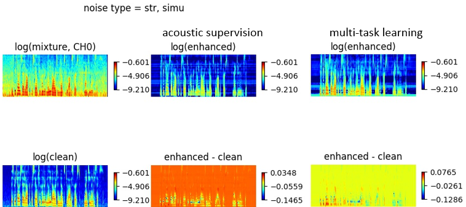
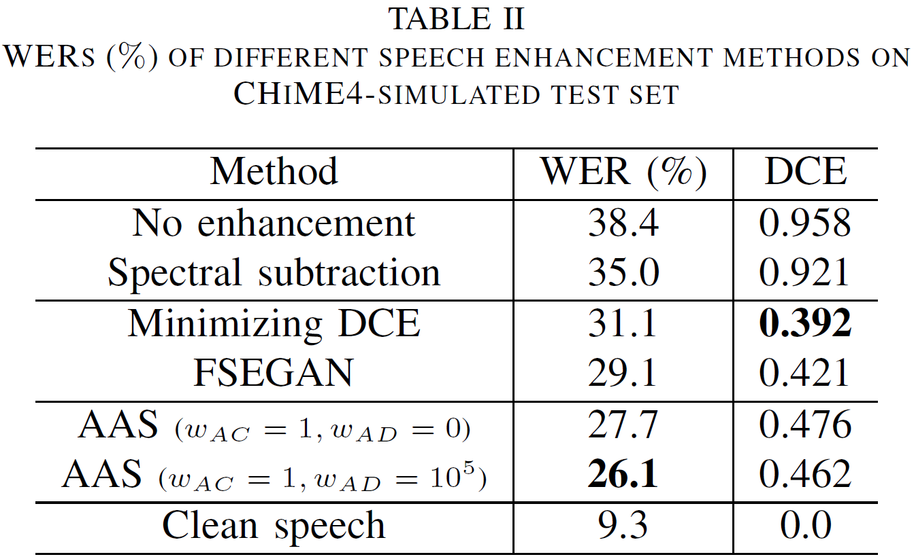
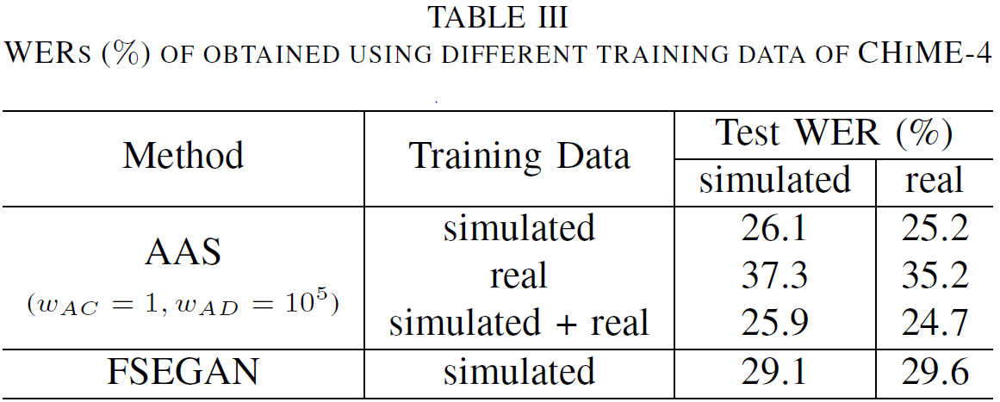

# AAS_enhancement
This repository contains the code and supplementary result for the paper "Unpaired Speech Enhancement by Acoustic and Adversarial Supervision" (submitted to IEEE Signal Processing Letters).

## Part 1. Pre-train acoustic model on clean speech

Code for this part is originated from https://github.com/SeanNaren/deepspeech.pytorch/.
We modify the feature from spectrogram to log-Mel filterbank output (LMFB), and 2D convolutional layer to 1D convolutional layer.

### Installation
1. Clone the repo.
2. Install Warp-CTC, ctcdecode (See https://github.com/SeanNaren/deepspeech.pytorch/#installation).
3. Install requirements by
```
pip install -r requirements.txt
```

### Usage

#### Dataset
We trained acoustic model on Librispeech corpus.
To download and setup Librispeech, see https://github.com/SeanNaren/deepspeech.pytorch/#librispeech

#### Training
You can train the acoustic model used in the paper with command below:
```
python train.py --gpu 0 --expnum 1  --batch_size 30 --conv_layers 2 --conv_map 128 --conv_kernel 11 --conv_stride 2 --rnn_layers 5 --rnn_size 1000 --lr 1e-4
```

#### Testing
Generate grapheme probability estimated from the acoustic model on validation data.
```
python test.py --model_path models/librispeech_final.pth.tar --test_manifest data/librispeech_LMFB_valid_manifest.csv --gpu 0 --output_path decoding/out_valid
```

Next, beam search by combining AM and 4-gram LM score. Find the optimal (alpha, beta) which achieves the lowest WER on the validation data. We search (alpha, beta) by 6x6 grid search. The range of alpha and beta are 1.0 ~ 3.0 and 0.0 ~ 0.5
```
python tune_decoder.py --model_path models/librispeech_final.pth.tar --test_manifest data/librispeech_LMFB_valid_manifest.csv --logits decoding/out_valid.npy --log_path decoding/log_valid.json --result_path decoding/result_valid.json --beam_width 100 --lm_path ../kenLM/4-gram.bin --lm_num_alphas 6 --lm_num_betas 6 --lm-alpha-from 1.0 --lm-alpha-to 3.0 --lm-beta-from 0.0 --lm-beta-to 0.5
```

With a given alpha = 0.4, beta = 2.2 repeat the procedures on test data.
```
python test.py --model_path models/librispeech_final.pth.tar --test_manifest data/librispeech_LMFB_test_clean_manifest.csv --gpu 0 --output_path decoding/out_test

python tune_decoder.py --model_path models/librispeech_final.pth.tar --test_manifest data/librispeech_LMFB_test_clean_manifest.csv --logits decoding/out_test.npy --log_path decoding/log_test.json --result_path decoding/result_test.json --beam_width 100 --lm_path ../kenLM/4-gram.bin --lm_num_alphas 1 --lm_num_betas 1 --lm-alpha-from 0.4 --lm-alpha-to 0.4 --lm-beta-from 2.2 --lm-beta-to 2.2
```

#### Pre-trained model
The pre-trained acoustic model (librispeech_final.pth.tar) can be available in [this link](https://cnsl.kaist.ac.kr).


### Result
The pre-trained acoustic model combined with the LM achieves a WER of 5.7% on the test-clean of Librispech, which is competitive with DNN-HMM (5.3%, [Panayotov et al.](https://www.danielpovey.com/files/2015_icassp_librispeech.pdf))


## Part 2. Speech Enhancement with Acoustic and Adversarial Supervision (AAS)
We provide the procedure to reproduce the results of AAS tested on CHiME-4.

### Installation

### Usage

#### Dataset: CHiME-4 (single channel track)

#### Train AAS

You can choose training data as simulated, real or both of them.

#### Train other methods

##### Spectral subtraction

##### Minimizing DCE

##### FSEGAN


### Results

#### Visualize enhanced sample




#### Decoding




##### with various task weight

##### without enhancement

##### with spectral subtraction

##### with minimized DCE

##### with FSEGAN

##### with AAS

##### with clean speech
